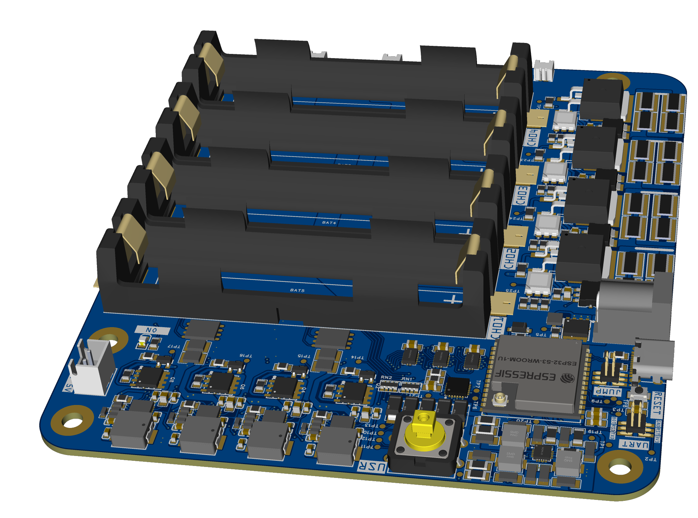

# 🔋 Multi-Channel Smart Battery Management System

This project implements a **4-channel battery charging and monitoring system** using an **ESP32**, **BQ2589x charger ICs**, **ACS781 current sensors**, **TCA9548A I2C multiplexer**, and **74HC595 shift registers**.  
Each battery channel supports real-time telemetry, RGB status indication, load-based capacity estimation, and user-triggered commands via a shared button.

## Hardware (3D)




---

## 📘 Class Overview

| Class                                                  | Responsibility                                                          |
| ------------------------------------------------------ | ----------------------------------------------------------------------- |
| [`DeviceManager`](#-devicemanager)                     | Initializes and connects all hardware subsystems                        |
| [`ChannelManager`](#-channelmanager)                   | Manages one battery channel: charger, LED, sensor, capacity, telemetry  |
| [`SwitchManager`](#%EF%B8%8F-switchmanager)                      | Handles tap/hold button input to trigger channel-specific actions       |
| [`GpioManager`](#-gpiomanager)                         | Manages GPIO pins and shift register for RGB and load control           |
| [`Tca9548aMux`](#-tca9548amux--i2c-multiplexer-manager)                         | Controls I2C multiplexer to route communication to each charger         |
| [`bq2589x`](#-bq2589x)                                 | External driver class for interfacing with the BQ2589x charger IC       |
| [`config.h`](#%EF%B8%8F-configh--central-configuration-header) | Central configuration file for pins, charger settings, and debug macros |

---

## ⚙️ System Architecture

- **Microcontroller**: ESP32 (any variant with ≥4 ADCs, I2C, and enough GPIOs)
- **Charging ICs**: 4× BQ2589x (1 per channel)
- **Voltage/Current Sensors**: 4× ACS781 (connected to ADC)
- **Shift Registers**: 3× 74HC595 (controls RGB LEDs + load switches)
- **Multiplexer**: 1× TCA9548A I2C Mux (selects each charger’s I2C path)
- **Button**: Single shared GPIO input for tap/hold control

---

## 🧠 Class Details

### 🔧 `DeviceManager`

- Manages 4 `ChannelManager` instances.
- Calls `.begin()` to initialize I2C, GPIO, and all channels.
- Starts the `SwitchManager` to monitor button inputs.
- Periodically calls `.sendCapacityReport()` for each channel.

---

Here is the updated `README.md` section for **`ChannelManager`**, rewritten in detail and properly formatted based on your provided header file:

---

### 🔌 `ChannelManager`

The `ChannelManager` class encapsulates all hardware and logic required to operate a **single battery charging channel**. It controls the charger IC, monitors charging status, handles RGB LED indicators, manages load-based capacity estimation, and routes I2C commands via a TCA9548A multiplexer.

---

#### 🧩 Responsibilities

* **BQ2589x Charger Control**

  * Initializes and configures the charger IC.
  * Sets charge voltage, current, watchdog, OTG boost.
  * Starts/stops charging dynamically.

* **I2C MUX Selection**

  * Activates the correct TCA9548A channel using `setMuxActive()`.

* **Voltage & Current Monitoring**

  * Reads analog voltage from ACS781 sensor connected to ADC.
  * Calculates current draw for capacity estimation.

* **Capacity Estimation**

  * Activates a 2Ω load resistor briefly.
  * Measures voltage drop to estimate energy in mWh.

* **LED Status Feedback**

  * Controls RGB LED using 74HC595 shift register.
  * Updates color to reflect current charging status.

* **Charger Status Input Pins**

  * Reads PG (Power Good), STAT (Charging Status), and INT (Interrupt).

---

#### 📦 Constructor

```cpp
ChannelManager(uint8_t muxChannel,
               GpioManager* gpio,
               ShiftPin rPin, ShiftPin gPin, ShiftPin bPin,
               ShiftPin otgPin, ShiftPin cePin,
               ShiftPin loadPin, uint8_t voltageAdcPin,
               uint8_t intPin, uint8_t statPin, uint8_t pgPin);
```

* `muxChannel`: TCA9548A channel (0–7) for this battery.
* `gpio`: Pointer to a shared `GpioManager` instance.
* `ShiftPin` parameters: shift register pin mappings for RGB LED, OTG, CE, and load control.
* `voltageAdcPin`: ADC input connected to the current sensor.
* `intPin`, `statPin`, `pgPin`: Digital input pins from the charger.

---

#### 🔧 Initialization

```cpp
void begin(TwoWire& wire);
void initCharger();
```

* `begin()`: Initializes the charger on the given I2C bus.
* `initCharger()`: Sets default charge voltage, current, watchdog timer, OTG mode, and disables charging initially.

---

#### ⚡ Charger Control

```cpp
void startCharging();
void stopCharging();
bool isCharging();
void setChargingVoltage(uint16_t voltage_mV);
void setChargingCurrent(uint16_t current_mA);
```

* Direct charger control through I2C.
* Charger enable/disable managed via CE pin and BQ registers.

---

#### 📊 Status Monitoring

```cpp
ChargingStatus getStatus();
bool readInt();
bool readStat();
bool readPGood();
```

* `getStatus()`: Returns all runtime measurements:

  * Battery/System/VBUS voltage
  * Charge current
  * Die temperature
  * Charging flags (done/enabled)
  * Status pins and charger text
* Other methods give access to charger signal pins (PG, INT, STAT).

---

#### 🧮 Capacity Estimation

```cpp
float measureCapacity();
void sendCapacityReport();
```

* `measureCapacity()`:

  * Briefly activates load resistor.
  * Measures current delta from sensor before/after.
  * Computes estimated energy (mWh) using:

    ```
    P = ΔI² × R
    E = P × Δt
    Capacity = E / 3600
    ```
* `sendCapacityReport()`:

  * Outputs real-time JSON over serial:

    ```json
    {
      "channel": 2,
      "voltage": 3.92,
      "capacity_mWh": 15.7,
      "charging": false
    }
    ```

---

#### 🎨 RGB LED Control

```cpp
void setRgbColor(bool r, bool g, bool b);
void updateLedFromStatus();
```

* Controls 3 shift register pins for Red, Green, Blue.
* `updateLedFromStatus()` sets colors based on current charging state:

  * 🔴 Not charging
  * 🟢 Charging
  * 🔵 Fully charged

---

#### ⚙️ Miscellaneous

```cpp
void setCE(bool enabled);
void setOTG(bool enabled);
bq2589x& getBQ();
uint8_t getMuxAddress() const;
uint8_t getMuxChannel() const;
void setMuxActive(TwoWire& wire);
```

* OTG and CE modes toggled via shift register.
* Exposes BQ2589x driver reference and mux metadata.

---

### 🧲 `GpioManager`

The `GpioManager` class abstracts all GPIO configuration and **shift register control** for the system. It is responsible for initializing ADC pins, configuring the 74HC595 control lines, and maintaining a 24-bit internal state representing all output bits (RGB LEDs, CE, OTG, load control).

---

#### 🧩 Responsibilities

* Sets up GPIOs for ADC input (connected to current sensors).
* Configures and manages 74HC595 shift register control pins:

  * `SER`, `SCK`, `RCK`, `MR`, `OE`
* Maintains a **24-bit shift state** representing outputs across 3 chained shift registers.
* Offers pin-level control over all connected outputs using `ShiftPin` IDs (0–23).
* Handles low-level shifting and latching of bits to register chain.

---

#### 🛠️ Initialization

```cpp
void begin();
```

* Configures:

  * `VOUTCRR1_PIN` to `VOUTCRR4_PIN` as ADC inputs
  * Shift control pins as OUTPUT:

    * `SHIFT_SER_PIN`, `SHIFT_SCK_PIN`, `SHIFT_RCK_PIN`, `SHIFT_OE_PIN`, `SHIFT_MR_PIN`
* Enables output (`OE = LOW`) and disables master reset (`MR = HIGH`)
* Clears the register contents to all LOW using `resetShiftRegisters()` + `shiftOutState()`

---

#### 💡 Shift Register State Management

```cpp
void setShiftPin(ShiftPin pin, bool level);
void applyShiftState();
```

* `setShiftPin(pin, level)`:

  * Modifies one virtual output bit in memory
  * Does not immediately update hardware
* `applyShiftState()`:

  * Pushes all 24 bits from memory to the 74HC595 outputs

#### 🔄 Reset & Output Control

```cpp
void resetShiftRegisters();
void enableShiftRegisterOutput(bool enable);
```

* `resetShiftRegisters()`:

  * Briefly pulls `MR` LOW, clearing all bits
* `enableShiftRegisterOutput(enable)`:

  * Controls `OE` pin to enable/disable physical output

---

#### 🔁 Bit Shifting (Internal)

```cpp
void shiftOutState();
```

* Sends all 24 bits from `shiftState` to the shift register
* Outputs MSB first (bit 23 to 0)
* Uses standard 595 sequence:

  * `SER` (data) + `SCK` (clock) for each bit
  * Final `RCK` pulse to latch into output

---

#### 🧠 Example Use

To change the color of an RGB LED:

```cpp
gpioManager.setShiftPin(SHIFT_R1, true);
gpioManager.setShiftPin(SHIFT_G1, false);
gpioManager.setShiftPin(SHIFT_B1, false);
gpioManager.applyShiftState();
```

This turns the LED red by enabling only the R pin. Changes are staged until `applyShiftState()` is called.

---

### 🔧 `Tca9548aMux` – I2C Multiplexer Manager

The `Tca9548aMux` class provides high-level control over the [TCA9548A I2C multiplexer](https://www.ti.com/product/TCA9548A), allowing the microcontroller to route I2C communication to one of eight selectable downstream channels. This is especially useful when managing multiple devices that share the same I2C address, such as battery charger ICs on separate channels.

#### ✅ Responsibilities:

* Manages multiplexer reset, initialization, and channel selection
* Supports runtime switching between up to 8 I2C buses
* Keeps track of the currently selected channel
* Safely disables all channels when needed

---

#### 🔩 Features

* **Address Pins Initialization**: Sets the address pins A0–A2 to `LOW`, selecting the default TCA9548A address (`0x70`).
* **Reset Handling**: Issues a controlled reset on startup and supports manual resets via `reset()`.
* **Channel Selection**: Dynamically enables any of the 8 mux channels using `selectChannel(uint8_t channel)`.
* **State Tracking**: Remembers the last selected channel and avoids redundant I2C writes.
* **Disabling Channels**: Turns off all channels cleanly with `disableAll()`.

---

#### 🧪 Example Usage

```cpp
TwoWire myWire = Wire;
Tca9548aMux mux(&myWire, 0x70);

void setup() {
    mux.begin();        // Sets address pins, resets the mux, prepares I2C
    mux.selectChannel(0);  // Enables channel 0 for communication
}
```

---

#### 🔁 Methods

| Method                      | Description                                           |
| --------------------------- | ----------------------------------------------------- |
| `begin()`                   | Initializes pins A0–A2, performs hardware reset       |
| `reset()`                   | Manually resets the multiplexer                       |
| `selectChannel(uint8_t)`    | Activates the specified channel (0–7)                 |
| `disableAll()`              | Disables all channels (clears control register)       |
| `isChannelEnabled(uint8_t)` | Returns whether the given channel is currently active |
| `getCurrentSelection()`     | Returns current control register bitmask              |
| `getAddress()`              | Returns the I2C address of the mux                    |
| `writeMux(uint8_t)`         | Internal method to write control byte over I2C        |

---

## 🖲️ `SwitchManager`

- Detects tap or hold interactions on one button.
- Launches a FreeRTOS task (`SwitchTask()`).
- Maps 1 to 4 tap counts to trigger capacity tests on the corresponding channel:

| Tap Count | Action                         |
|-----------|--------------------------------|
| 1 tap     | Measure capacity on channel 1  |
| 2 taps    | Measure capacity on channel 2  |
| 3 taps    | Measure capacity on channel 3  |
| 4 taps    | Measure capacity on channel 4  |

---

## ⚙️ `config.h` – Central Configuration Header

This file acts as the **master control panel** for system settings, pin mappings, charger parameters, and debug behavior. It promotes maintainability and simplifies hardware configuration across the firmware.

---

### 🔍 Debugging Macros

```cpp
#define DEBUGMODE true
#define ENABLE_SERIAL_DEBUG
```

* `DEBUGMODE`: Enables or disables all debug prints globally.
* `ENABLE_SERIAL_DEBUG`: Activates `Serial.print` macros.
* Includes:

  * `DEBUG_PRINT(x)`
  * `DEBUG_PRINTLN(x)`
  * `DEBUG_PRINTF(...)`

---

### 🖧 Serial Configuration

```cpp
#define SERIAL_BAUD_RATE 921600
```

* Configures high-speed debug and telemetry output.

---

### 📡 Analog Input Pins (Current Sensor ADC)

```cpp
#define VOUTCRR1_PIN 1
#define VOUTCRR2_PIN 2
#define VOUTCRR3_PIN 6
#define VOUTCRR4_PIN 7
```

* Reads analog voltage output from ACS781 current sensors.

---

### 🔋 Discharge Load Parameters

```cpp
#define LOAD_RESISTOR_OHMS    2.0f
#define LOAD_RESISTOR_POWER_W 12.0f
```

* Defines value and power limit for each channel’s test resistor.

---

### ⚡️ Current Sensor Calibration (ACS781)

```cpp
#define CURRENT_SENSOR_SENSITIVITY   0.0132f
#define CURRENT_SENSOR_ZERO_VOLTAGE 1.65f
#define ADC_REF_VOLTAGE              3.3f
#define ADC_RESOLUTION               4096.0f
```

* Used for converting raw ADC values into amperes using sensor transfer function.

---

### ⏹️ Shift Register Control Pins (74HC595)

```cpp
#define SHIFT_MR_PIN  15
#define SHIFT_SCK_PIN 16
#define SHIFT_RCK_PIN 17
#define SHIFT_SER_PIN 18
#define SHIFT_OE_PIN  38
```

* Controls latch, clock, and output for the 3 daisy-chained shift registers.

---

### 🔄 Shift Register Output Mapping

```cpp
enum ShiftPin {
  SHIFT_R1, SHIFT_G1, SHIFT_B1,  // RGB Channel 1
  SHIFT_CE1, SHIFT_OTG1,         // Control Channel 1
  SHIFT_LD01,                    // Load Channel 1
  ...
};
```

* Logical mapping of shift register outputs for:

  * RGB LED control (`SHIFT_Rx`, `Gx`, `Bx`)
  * Charger control (`SHIFT_CEx`, `OTGx`)
  * Load activation (`SHIFT_LDx`)

---

### 📊 `ChargingStatus` Struct

```cpp
struct ChargingStatus {
  float batteryVoltage;
  float chargeCurrent;
  ...
};
```

* Returned by `ChannelManager::getStatus()`
* Includes:

  * Battery and system voltage
  * Charge current and temp
  * PG, STAT, INT pin states
  * Charging status text

---

### 📶 Charger Interrupt & Status Pins

```cpp
#define INT1_PIN  47
#define STAT1_PIN 48
#define PG1_PIN   45
...
#define INT4_PIN  8
#define STAT4_PIN 9
#define PG4_PIN   3
```

* Dedicated digital inputs per BQ2589x charger for monitoring fault and charging states.

---

### ⚙️ Default Charging Parameters

```cpp
#define BQ2589X_I2C_ADDR           0x6A
#define DEFAULT_CHARGE_VOLTAGE_MV 4200
#define DEFAULT_CHARGE_CURRENT_MA 1500
#define DEFAULT_BOOST_VOLTAGE_MV  5000
#define DEFAULT_BOOST_CURRENT_MA  1000
```

* Applied on `ChannelManager::initCharger()` if no override is set.

---

### 🧭 I2C Bus Configuration

```cpp
#define I2C_SDA_PIN 4
#define I2C_SCL_PIN 5
```

* Used by both the multiplexer and all BQ2589x chargers.

---

### 🔀 TCA9548A I2C Multiplexer

```cpp
#define TCA9548A_ADDR 0x70
#define TCA_RESET_PIN 42
#define TCA_A0_PIN    41
#define TCA_A1_PIN    40
#define TCA_A2_PIN    39
```

* Allows ESP32 to switch between 4 independent I2C charger ICs.

---

### 👆 User Button Input

```cpp
#define USR_SWITCH_PIN 0
```

* Shared tap/hold button read by `SwitchManager` to initiate channel actions.

---

### 📦 `bq2589x`

External driver class (not detailed here) that supports:
- `begin()`
- `set_charge_voltage()`, `set_charge_current()`
- `enable_charger()`, `disable_charger()`
- `adc_read_battery_volt()`, `adc_read_sys_volt()`, etc.

---

## 📡 Real-Time JSON Output

Example output from `sendCapacityReport()`:

```json
{
  "channel": 1,
  "voltage": 4.19,
  "capacity_mWh": 27.34,
  "charging": true
}
````

---

## 📁 File Structure

```
/src
├── DeviceManager.h/.cpp      → Top-level manager and initializer
├── ChannelManager.h/.cpp     → Controls a single battery channel
├── SwitchManager.h/.cpp      → Tap/hold detection
├── GpioManager.h/.cpp        → GPIO and shift register abstraction
├── Tca9548aMux.h/.cpp        → I2C multiplexer control (TCA9548A)
├── bq2589x.h/.cpp            → BQ2589x chip driver
├── main.cpp                  → Arduino-style entry point
```

---

## 🔋 Capacity Estimation Logic

1. Activate load resistor briefly via shift register.
2. Measure voltage before and after using ACS781.
3. Calculate current and estimate energy:

   ```
   ΔI = I_after - I_before
   Power = ΔI² × R
   Energy = Power × time (e.g. 100ms)
   Capacity ≈ mWh = energy (mWs) / 3600
   ```

---

## 🛠️ Setup Instructions

### 📦 Hardware Required

* 1× ESP32
* 4× BQ2589x
* 4× ACS781LLRTR-100B-T
* 3× 74HC595
* 1× TCA9548A
* 4× 2Ω, 12W power resistors
* 1× Push Button

### 🧪 Enable Debugging

To see logs over serial:

```cpp
Serial.begin(SERIAL_BAUD_RATE);
```

---

## 🔁 Runtime Behavior

* System initializes I2C, GPIO, and channels.
* Each channel is assigned a MUX slot (0–3).
* LEDs reflect charger state (red/green/blue).
* User taps the button:

  * Tap 1–4 times to measure capacity of that channel.
* `sendCapacityReport()` is called periodically in the loop.

---

## 🧠 Future Extensions

* BLE or Wi-Fi telemetry
* Web dashboard for monitoring
* SD card data logging
* OTA firmware updates

---

## 👤 Author

**Tshibangu Samuel**
🎯 Freelance Embedded Systems Engineer
📧 [tshibsamuel47@gmail.com](mailto:tshibsamuel47@gmail.com)
📱 +216 54 429 793
🌍 [Freelancer Profile](https://www.freelancer.com/u/tshibsamuel477)

---

```
